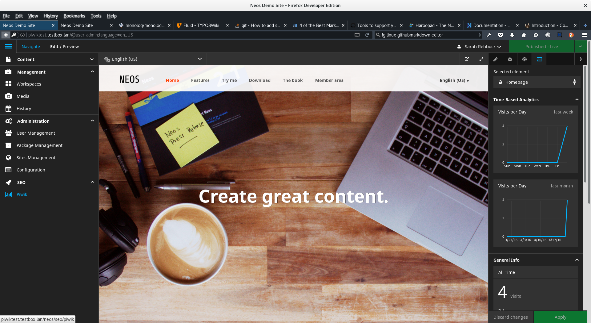

# Portachtzig Neos Piwik Package

[](https://packagist.org/packages/portachtzig/neos-piwik)
[](https://packagist.org/packages/portachtzig/neos-piwik)

**Track visits of your Neos site with Piwik Analytics!**

This package integrates Piwik Analytics into Neos.

**Features**
 + adds a Backend Module to your Neos instance which helps hooking up a Piwik host and selecting a site for tracking
 + adds a tab to the Property Inspector, which shows time, device, OS and browser related statistics collected by Piwik


Inspired by the packages [neos/neos-googleanalytics](https://github.com/neos/neos-googleanalytics) and [khuppenbauer/MapSeven.Piwik](https://github.com/khuppenbauer/MapSeven.Piwik).


- - -


> Piwk - Liberating Analytics
> http://piwik.org/

- - -


## Requirements

+ **cURL php extension** for api calls
+ **Neos CMS** >= 3.0
+ A **Piwik instance** that is reachable via **https**
+ A Neos Backend User with the Role **Neos.Neos:Administrator**

- - -

## Installation

Run the following command
```
	$ composer require portachtzig/neos-piwik
```

## Configuration
After the package has been installed, there will be an additional Backend Module in Neos, called "Piwik".
Depending on your current FLOW_CONTEXT you might want to flush the cache.


To connect Neos with your Piwik installation you just have to enter your hostname and token_auth in the Backend Module and select the site you created in Piwik to track your user's statistics.


+ **Host**
You can skip the protocol prefix, because https is forced here, since the authentication token is an URL parameter.

+ **Token**
You have to enter a valid auth token of a Piwik superuser, because only superusers can list and edit sites in Piwik.

+ **Piwik Site to use for this Neos installation**
After the connection has been established, the form will provide you with a site select box.

Additionally you will be able to edit basic settings of all your Piwik sites.

## License
Portachtzig Neos Piwik Package is released under the GPL v3 (or later) license.

## Contact

**Christian Richter** <chri@portachtzig.com>
**Sarah Rehbock** <sar@portachtzig.com>

## Screenshots 


Piwik site settings in Neos



Backend view with selected Piwik Panel in the Property Inspector


visits per day in the last month 


visits per day in the last week 


all time visits and page views (hits) of the selected page


visits per browser (all time)


visits per os (all time)


visits per device category (all time)

