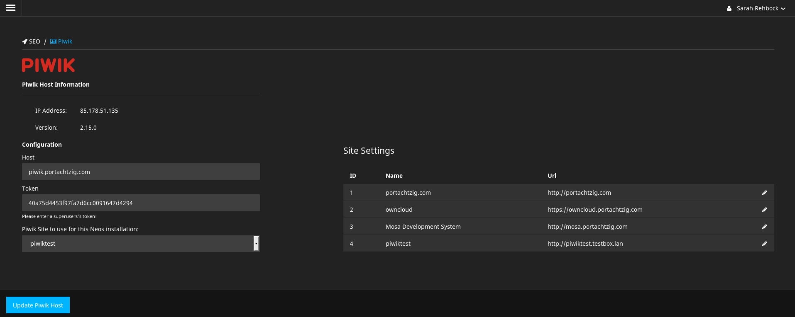
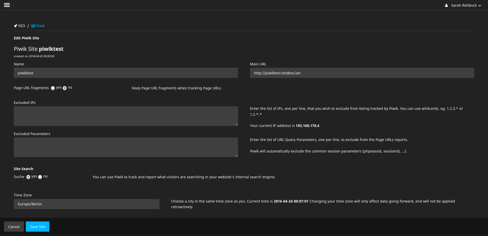
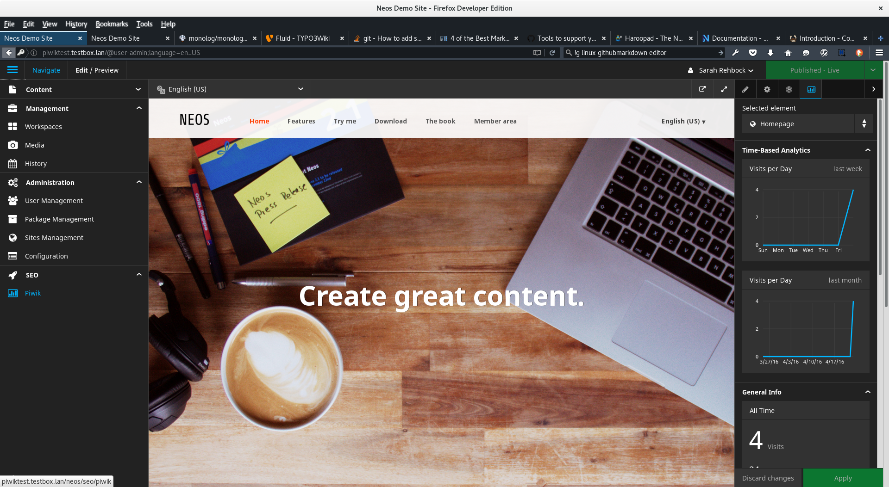

# Neos Matomo Package

[](https://packagist.org/packages/flowpack/neos-matomo)
[](https://packagist.org/packages/flowpack/neos-matomo)

**Track visits of your Neos site with Matomo (Piwik) Open Analytics Platform!**

This package integrates the `Matomo Open Analytics Platform` into Neos and is also compatible with older `Piwik` installations.

**Features**
 + adds a Backend Module to your Neos instance which helps hooking up a Matomo host and selecting a site for tracking
 + adds a tab to the Property Inspector, which shows time, device, OS and browser related statistics collected by Matomo
 + adds a customizeable content element which allows visitors to opt-out of tracking in the frontend

Inspired by the packages [neos/neos-googleanalytics](https://github.com/neos/neos-googleanalytics) and [khuppenbauer/MapSeven.Piwik](https://github.com/khuppenbauer/MapSeven.Piwik).

Initially this package was called `portachtzig/neos-piwik`. Thanks to the creators @koernchen02 and @sarahRehbock for all their work! 

- - -
   

> Matomo - Open Analytics Platform
> https://matomo.org/

- - -


## Requirements

+ **cURL php extension** for api calls
+ **Neos CMS** >= 3.3
+ A **Matomo instance** that is reachable via **https**
+ A Neos Backend User with the Role **Neos.Neos:Administrator**

- - -

## Installation

Run the following command
```
	$ composer require flowpack/neos-matomo
```

### Updating from `neos-piwik` to `neos-matomo`

Instead of requiring `portachtzig/neos-piwik` you should now require `flowpack/neos-matomo` in your `composer.json`.

Also if you use or override `Flowpack.Neos.Matomo:StatsTabMixin` you'll have to change the naming  
in your own NodeType configurations to `Flowpack.Neos.Matomo:StatsTabMixin`. 

## Configuration
After the package has been installed, there will be an additional Backend Module in Neos, called "Matomo".
Depending on your current FLOW_CONTEXT you might want to flush the cache.




To connect Neos with your Matomo installation you just have to enter your hostname and token_auth in the Backend Module and select the site you created in Matomo to track your user's statistics.


+ **Host**
You can skip the protocol prefix, because https is forced here, since the authentication token is an URL parameter.

+ **Token**
You have to enter a valid auth token of a Matomo superuser, because only superusers can list and edit sites in Matomo.

+ **Matomo Site to use for this Neos installation**
After the connection has been established, the form will provide you with a site select box.

Additionally you will be able to edit basic settings of all your Matomo sites.

## Additional features

### Tracking Opt-Out content element

This package provides a small configurable iframe content element for Neos which allows users
to manually opt out of the tracking if "Do-Not-Track" is not enabled in their browser.
The content of the iframe is loaded from the configured tracking host.

You can adjust all settings that Matomo offers via their API.

## License
Neos Matomo Package is released under the GPL v3 (or later) license.

## Screenshots 



Matomo site settings in Neos



Backend view with selected Matomo Panel in the Property Inspector


visits per day in the last month 


visits per day in the last week 


all time visits and page views (hits) of the selected page


visits per browser (all time)


visits per os (all time)


visits per device category (all time)

