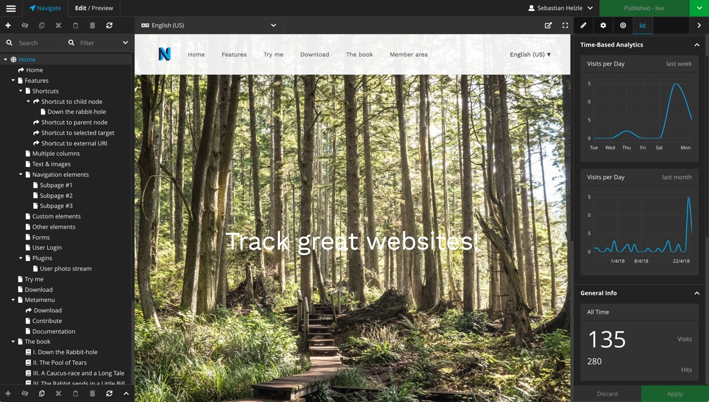

# Neos Matomo Package

**Track visits of your Neos site with Matomo (Piwik) Open Analytics Platform!**

This package integrates the `Matomo Open Analytics Platform` into Neos and is also compatible with older `Piwik` installations.

**Features**
 + adds a Backend Module to your Neos instance which helps checking your configuration
 + adds a tab to the Property Inspector, which shows time, device, OS and browser related statistics collected by Matomo
 + adds a customizeable content element which allows visitors to opt-out of tracking in the frontend
 + Matomo Tag Manger support

Inspired by the packages [neos/neos-googleanalytics](https://github.com/neos/neos-googleanalytics) and [khuppenbauer/MapSeven.Piwik](https://github.com/khuppenbauer/MapSeven.Piwik).

Initially this package was called `portachtzig/neos-piwik`. Thanks to the creators @koernchen02 and @sarahRehbock for all their work! 

- - -
   

> Matomo - Open Analytics Platform
> https://matomo.org/

- - -

## Requirements

+ **cURL php extension** for api calls
+ **Neos CMS** >= 3.3
+ **Matomo** >= 3.3
+ A **Matomo instance** that is reachable via **https**
+ A Neos Backend User with the Role **Neos.Neos:Administrator**

### Compatibility with older versions

The version 2 of this package is still compatible with Piwik instances
but might at some point not work anymore when Matomo gets a bigger update.

Always check that your tracking software is up-to-date and use the latest
releases of this package if possible.

- - -

## Installation

Run the following command in your site package

    composer require --no-update flowpack/neos-matomo
    
Then run `composer update` in your project root.

### Updating from `neos-piwik` to `neos-matomo`

Instead of requiring `portachtzig/neos-piwik` you should now require `flowpack/neos-matomo` in your `composer.json`.

Also if you use or override `Portachtzig.Neos.Piwik:StatsTabMixin` you'll have to change the naming  
in your own NodeType configurations to `Flowpack.Neos.Matomo:StatsTabMixin`. 

In your configuration file you have to change the path

    Portachtzig:
      Neos:
        Piwik:

to
    
    Flowpack:
      Neos:
        Matomo:
        
Also we added caching for the api requests. Therefore by default the statistics will be kept up to 5 minutes before 
a refresh occurs.

## Configuration
After the package has been installed, there will be an additional Backend Module in Neos, called "Matomo".
Depending on your current FLOW_CONTEXT you might want to flush the cache.

To connect Neos with your Matomo installation you just have to enter some properties 
in your `Settings.yaml` to track your user's statistics. You can have the configuration in your site package
or add it during deployment.
You can also use the included backend module then to verify your configuration.

+ **host**
Enter your Matomo installations hostname without protocol. 

+ **host**
You should always have your Matomo installation configured with https, but you can change it for testing purposes.

+ **token_auth**
You have to enter a valid auth token of a Matomo user who has the `view` permissions for the configured site.

+ **idSite**
You have to enter the id of the site you configured in Matomo.
This is also needed when using Matomo Tag Manager to allow showing statistics in the backend.

+ **containerId**
You have to enter the id of the tag manager container you configured in Matomo.
Here you can also use the longer ids generated for dev & staging environments.

+ **system**
You can change the System you're using so it will target the right Tracking Code.
Defaults to `matomo`, if needed, set it to `piwik`

+ **apiTimeout**
You can change the default timeout of 10 seconds after which the backend will cancel requests to your
Matomo installation.

+ **privacyManagement**
You can change three ePrivacy/GDPR related variables and set Matomos tracking behaviour. By default all three variables are set to `false`. You can use these to set Matomo easily up to be GDPR comliant.
  - `disableCookies` will disable all cookies if set to `true` (see [Matomo FAQ 157](https://matomo.org/faq/general/faq_157/)).
  - `requireTrackingConsent` will require you to get a user's consent to tracking in general and `requireCookieConsent` will require you to get a user's consent to setting cookies. See [Matomo's tracking consent guide](https://developer.matomo.org/guides/tracking-consent) and/or [content tracking guide](https://developer.matomo.org/guides/content-tracking) for specifics.
  - additional Ressources:
    - [How do I use Matomo Analytics without consent or cookie banner?](https://matomo.org/faq/new-to-piwik/how-do-i-use-matomo-analytics-without-consent-or-cookie-banner/)
    - [How do I track a visitor without cookies when they have not given consent for tracking cookies?](https://matomo.org/faq/new-to-piwik/how-can-i-still-track-a-visitor-without-cookies-even-if-they-decline-the-cookie-consent/)

### This is an example of how it can look:

    Flowpack:
      Neos:
        Matomo:
          host: 'tracking.example.org'
          protocol: 'https'
          token_auth: 'abcdefg1234567890'
          idSite: 1                                           
          containerId: 'abcdef' # Optional
          system: 'matomo' # Optional, "matomo" or "piwik"
          apiTimeout: 10 
          cacheLifetimeByPeriod:
            year: 86400
            day: 3600

## Additional features

### Tracking Opt-Out content element

This package provides a small configurable iframe content element for Neos which allows users
to manually opt out of the tracking if "Do-Not-Track" is not enabled in their browser.
The content of the iframe is loaded from the configured tracking host.

You can adjust all settings that Matomo offers via their API.      

### API request caching

By default the requests to the Matomo API will be cached depending on the period of the stat that is being checked.
Some information is shown based on a period of a year. Here we use a default timeout of 1 day.
Other stats are for one to several days. Here the preset for the timeout is 1 hour.

The timeouts by period can be overriden in your `Settings.yaml`. See the example above.

You can override the cache backend settings of this package in your own `Caches.yaml`:

    FlowpackNeosMatomo_ApiCache:
      backend: Neos\Cache\Backend\FileBackend
      backendOptions:
        defaultLifetime: 300
        
And if you don't want caching at all, just use the backend `Neos\Cache\Backend\NullBackend` instead of the 
configured `FileBackend`. 

### Accessing the Matomo API

You can access the Matomo API through this package by injecting the `Flowpack\Neos\Matomo\Service\Reporting` class.

You can then use the public method `callAPI($methodName, $arguments = [], $useCache = true)` to call any API method 
of Matomo and you will get the json decoded response as array.
Some methods will need specific user permissions, if your tokens user doesn't have them a error message will be in the
array.

### Multi site compatibility

The Matomo site id and token in the `Settings.yaml` can also be defined as array and this way you can configure as many sites 
as you want. The plugin will then check for the current sites nodename in this array.
If no matching site is found, the first entry will be used.

See this example with one token but several sites:

    Flowpack:
      Neos:
        Matomo:
          host: tracking.example.org
          token_auth: 12345678910
          idSite:
            myfirstsite: 1
            mysecondsite: 2
            mythirdsite: 2

And the same when used with tag manager:

    Flowpack:
      Neos:
        Matomo:
          host: tracking.example.org
          token_auth: 12345678910     
          idSite:
            myfirstsite: 1
            mysecondsite: 2
            mythirdsite: 2
          containerId:
            myfirstsite: 'abc'
            mysecondsite: 'def'
            mythirdsite: 'ghi'

## License

Neos Matomo Package is released under the GPL v3 (or later) license.

## Screenshots 

Backend view with selected Matomo Panel in the Property Inspector

visits per day in the last month 

visits per day in the last week 

all time visits and page views (hits) of the selected page

visits per browser (all time)

visits per os (all time)

visits per device category (all time)

